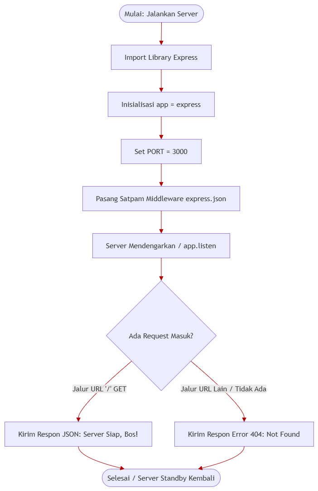

# 🚀 API Anti Mangkrak (Project Management Backend)

Sistem Backend API berbasis **Node.js** dan **Express.js** yang dirancang khusus untuk memantau, mencatat, dan mengelola daftar proyek kodingan agar tidak mangkrak di tengah jalan. Project ini menggunakan prinsip **CRUD Restful API** standar industri.

---

## 🗺️ Peta Jalan & Progress Pengembangan (Checklist)

- [x] **Tahap 1:** Inisialisasi Proyek & Git Lokal
- [x] **Tahap 2:** Setup Remote Repository & Sambung ke GitHub Akun 1
- [x] **Tahap 3:** Instalasi Express.js & Nodemon via PowerShell
- [x] **Tahap 4:** Konfigurasi `package.json` & File `.gitignore`
- [x] **Tahap 5:** Pembuatan Server Utama Dasar (`index.js`)
- [x] **Tahap 6:** Pembuatan Basis Data Sementara (Array Data Dummy)
- [x] **Tahap 7:** Implementasi Endpoint `GET /api/projects` (Read All)
- [x] **Tahap 8:** Implementasi Endpoint `GET /api/projects/:id` (Read Detail)
- [x] **Tahap 9:** Implementasi Endpoint `POST /api/projects` (Create)
- [x] **Tahap 10:** Implementasi Endpoint `PUT /api/projects/:id` (Update)
- [x] **Tahap 11:** Implementasi Endpoint `DELETE /api/projects/:id` (Delete)

---

---

## 🏗️ Struktur Arsitektur Folder (MVC Pattern)

```text
api-anti-mangkrak/
├── assets/
│   └── flowchart-backend-api.png
├── src/
│   ├── controllers/
│   │   └── projectController.js   # Menampung logika bisnis & data CRUD
│   └── routes/
│       └── projectRoutes.js      # Pemetaan jalur endpoint URL
├── .gitignore
├── index.js                      # Entry point server utama
├── package.json
└── README.md
```

## 🛠️ Stack Teknologi yang Digunakan

- **Runtime Environment:** Node.js
- **Framework Backend:** Express.js
- **Development Tool:** Nodemon (Auto-reload Server)
- **Version Control:** Git & GitHub

---

## 📡 Rencana Arsitektur Endpoint API

| Method HTTP | URL Endpoint        | Fungsi Utama                  | Status     |
| :---------- | :------------------ | :---------------------------- | :--------- |
| **GET**     | `/`                 | Cek Status Server Utama       | ✅ Aktif   |
| **GET**     | `/api/projects`     | Mengambil Semua Daftar Proyek | ✅ Rencana |
| **GET**     | `/api/projects/:id` | Mengambil Detail 1 Proyek     | ✅ Rencana |
| **POST**    | `/api/projects`     | Menambah Proyek Baru          | ✅ Rencana |
| **PUT**     | `/api/projects/:id` | Mengubah Status/Data Proyek   | ✅ Rencana |
| **DELETE**  | `/api/projects/:id` | Menghapus Proyek dari List    | ✅ Rencana |

---

## 📐 Arsitektur Alur Kerja Server (Flowchart)


